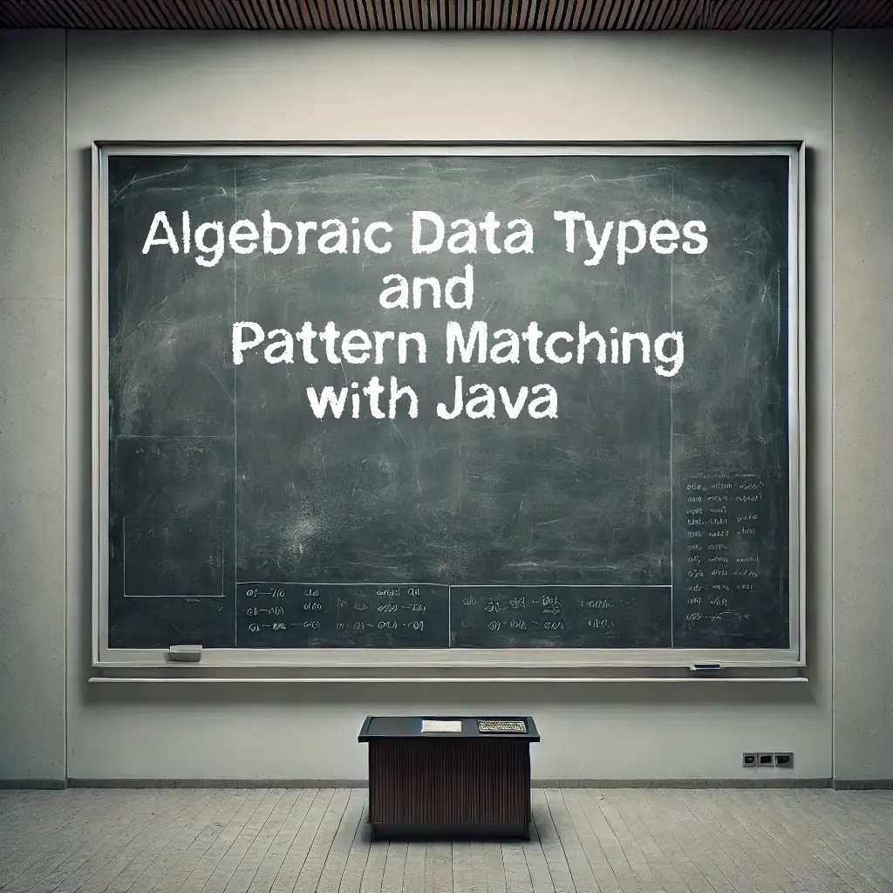

# Algebraic Data Types and Pattern Matching in Modern Java
(index.html) A reveal.js presentation exploring the concepts of Domain Modeling, Algebraic Data Types (ADTs), their implementation across various languages, and a deep dive into how modern Java (Java 21+) tackles these concepts using Records, Sealed Types, and Pattern Matching, contrasting it with the traditional Visitor pattern and addressing the Expression Problem.

This presentation accompanies the blogpost [Algebraic Data Types and Pattern Matching with Java](https://blog.scottlogic.com/2025/01/20/algebraic-data-types-with-java.html)

## Table of Contents

* [Viewing the Presentation](#viewing-the-presentation)
* [About the Presentation](#about-the-presentation)
* [Technology Used](#technology-used)
* [License](#license) 

## Viewing the Presentation

There are two main ways to view this presentation:

1.  **Online (Recommended if hosted on GitHub Pages):**
    * You can view the presentation directly online [here](https://magnussmith.github.io/adt-java-presentation/). 
2.  **Locally:**
   * Clone this repository: `git clone https://github.com/magnussmith/adt-java-presentation.git`
   * Navigate to the repository directory: `cd adt-java-presentation`
   * Open the `index.html` file in your web browser.

## About the Presentation

This presentation covers the following key topics:

* **Domain Modeling:**
    * The importance of modeling real-world problems.
    * Essential steps in creating a domain model.
    * Relating domain concepts to programming types and objects.
    * Connecting domain models to algebraic structures (Sets, Functions, Operations, Laws).
    * Benefits of an algebraic approach (Rigour, Testability, Maintainability).
    * A practical banking example.
* **Algebraic Data Types (ADTs):**
    * Why the term "Algebraic"? (Objects, Operations, Laws).
    * **Product Types ("AND"):** Definition, examples (Records, Structs), relation to Cartesian product.
    * **Sum Types ("OR"):** Definition, examples (Enums, Sealed Hierarchies), relation to unions.
    * Combining Product and Sum types and algebraic laws (Distributive, Commutative, Associative).
    * Key features and benefits of ADTs (Composition, Readability, Constraint Enforcement, Reduced Boilerplate).
* **Historical Perspective & Language Approaches:**
    * Origins in functional languages (ML, Hope, Haskell).
    * Simulating ADTs in C (Structs, Tagged Unions and their limitations).
    * Native support in Haskell (`data`).
    * Support in Scala (`case classes`, `sealed traits`).
    * Support in TypeScript (Interfaces, Union Types `|`, Discriminated Unions).
    * Limitations in Legacy Java (Pre-Java 17).
* **Modern Java (Java 17+):**
    * **Records:** Concise immutable data carriers (Product Types).
    * **Sealed Classes/Interfaces:** Controlled inheritance hierarchies (Sum Types).
    * **Pattern Matching:** Type-safe data extraction, especially with `switch` expressions.
    * Comparison with Java Enums.
* **The Visitor Pattern:**
    * Traditional approach in Java for operating on type hierarchies.
    * Implementation example using Shapes (Circle, Rectangle, etc.).
    * How it works (Double Dispatch).
* **Pattern Matching in Java:**
    * Modern alternative using Sealed Types, Records, and `switch`.
    * Implementation example for Shapes, calculating area and perimeter.
* **The Expression Problem:**
    * Definition: The challenge of extending data types and operations independently.
    * Comparing the Visitor Pattern and Pattern Matching in the context of the Expression Problem (trade-offs in adding new types vs. new operations, verbosity, exhaustiveness checking).

## Technology Used

* **reveal.js:** HTML Presentation Framework
* **Highlight.js:** Syntax highlighting for code examples
* **Font Awesome:** Icons (e.g., for list bullets)
* **KaTeX (via reveal.js math plugin):** Rendering mathematical formulas
* **Theme:** `catppuccin.css` (Custom or standard theme)

All necessary dependencies (CSS, JS) are either included in the repository (`dist/`, `plugin/`) or linked via CDN in `index.html`.

## License

This project is licensed under the MIT License - see the [LICENSE.md](LICENSE.md) file for details.